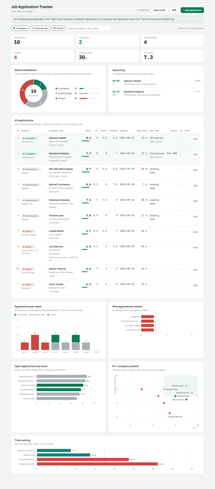

# Job Application Tracker

A single-file HTML dashboard for keeping track of job applications: status breakdown, upcoming interviews, a sortable application table, applications per week, reasons applications closed, and time spent waiting for a reply. Once you score applications, it also shows a score ranking and a "fit × company outlook" scatter chart. The interface switches between English and Chinese.

No server, database or install is needed. Double-click `index.html` to open it.

<picture>
  <source media="(prefers-color-scheme: dark)" srcset="docs/screenshot-dark.png">
  
</picture>

Screenshot uses the made-up example data from <code>data/example-applications.js</code>.

## Where the data lives

| File | Contents | Committed to git |
| --- | --- | --- |
| `index.html` | The dashboard | Yes |
| `data/example-applications.js` | Made-up example data | Yes |
| `data/my-applications.js` | Your own applications | **No** (listed in `.gitignore`) |

On load, the dashboard reads `data/my-applications.js`. If that file isn't there, for example after someone clones the repo or opens it on GitHub Pages, it shows the example data instead. The repo only ever contains the code and the examples; your applications stay on your own computer.

## Updating applications

- **Change a status**: click the status tag in the table and pick a stage (1st interview, 2nd interview, Rejected, No reply…). For interviews you can add the date in the same menu.
- **Add, edit or delete**: use "+ Add application" in the top-right corner, or "Edit" on any row.
- **Save**: changes are kept in the browser first, then written back to `data/my-applications.js`.
  - Chrome / Edge: the first time, click "Save to file" and choose `data/my-applications.js`. After that, changes are written automatically. After restarting the browser it may ask for write access again; click "Save to file" and allow it.
  - Other browsers: "Save to file" downloads `my-applications.js`. Move it into the `data/` folder to replace the old file.

You can also edit `data/my-applications.js` directly. The fields are described at the top of `data/example-applications.js`.

## First use after cloning

1. Open `index.html`. You'll see the example data.
2. Click "Save to file" and save it as `data/my-applications.js`.
3. Delete the examples or replace them with your own applications, either in the dashboard or by editing the file.

## Backups

`data/my-applications.js` is not in git, so back it up yourself, for example by keeping the folder in OneDrive or iCloud, or by copying the file now and then.
